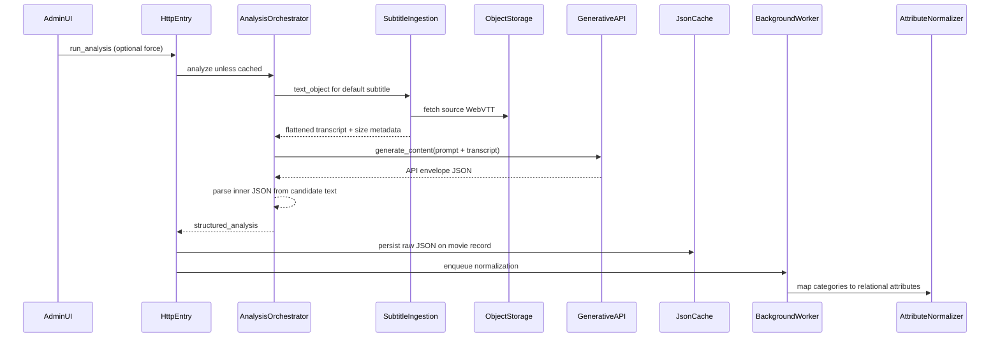

# Architecture — Subtitle file analyzer (2025)

> Publish to GitHub Wiki as **2025-Subtitle-File-Analyzer-Architecture** (flat page name).  
> **Public-safe** — topology and data flow only. Security: [README § Security](https://github.com/osuarez1/architectures/blob/main/README.md#security). Implementation lives in the private application monorepo.

How a movie’s **default-language** WebVTT subtitle file becomes **structured JSON metadata** via a generative API, and how that data is cached, normalized, and consumed.

Related: [[2025-Subtitle-File-Analyzer]] · [[Home]]

---

## 1. Purpose and scope

**Goal:** Extract structured metadata from the default-language subtitle transcript:

| Output category | Role |
|-----------------|------|
| `description` | Plot summary (length-capped, no spoilers) |
| `keywords`, `principles`, `people`, `locations`, `genre`, `audience`, `sentiment` | Tagged attributes with confidence scores |
| `beliefs` | Denomination-oriented analysis with confidence and textual reasons |

**Logical components** (private application monorepo):

| Component | Responsibility |
|-----------|----------------|
| Generative client | Stateless HTTP wrapper to provider `generateContent` |
| Analysis orchestrator | Builds prompt + transcript parts; parses API envelope into business JSON |
| Subtitle ingestion | Downloads WebVTT from object storage; flattens cue text |
| HTTP entry (admin) | Triggers analysis, applies cache, persists raw JSON |
| Attribute normalizer | Maps JSON categories into relational attribute rows (background) |

**Out of scope (related):** A separate subtitle analysis worker uses managed NLP key-phrase detection on the same flattened transcript path but does **not** call the generative API.

---

## 2. High-level flow

| Timing | Work |
|--------|------|
| **Synchronous (HTTP request)** | Generative API call, parse response, write raw JSON cache |
| **Asynchronous (background job)** | Normalize JSON into searchable attribute rows |

---

## 3. Entry points and triggers

| Entry | Behavior |
|-------|----------|
| Admin movie actions | “Run analysis” / “Force analysis” when a default-language subtitle exists |
| Bulk admin index | Lists titles with vs without default subtitles |
| HTTP action | Returns cached `structured_analysis` or generates new |

**Query params:** `force=true` bypasses cache and calls the generative API again.

**Prerequisites:**

1. Movie has a subtitle record for the configured default language code.
2. Source WebVTT exists in object storage for that movie and language.

---

## 4. Generative API client

Stateless HTTP wrapper with **no** movie or subtitle domain knowledge.

| Concern | Pattern |
|---------|---------|
| Transport | Provider REST `generateContent` for a configured default model |
| Auth | API key from application configuration (not documented here) |
| Request shape | `contents[].parts[]` text segments; optional JSON response MIME |
| Return value | Parsed **API envelope** (not the business schema) |
| Errors | Missing credentials vs HTTP/parse failures surfaced to orchestrator |

Callers pass an array of `{ text: "..." }` parts (instruction prompt + transcript). The business JSON lives in a **string** inside `candidates[0].content.parts[0].text` and must be parsed separately.

---

## 5. Subtitle ingestion

| Step | Action |
|------|--------|
| 1 | Resolve default-language subtitle for the movie |
| 2 | Download source WebVTT from object storage to a temp file |
| 3 | Parse cues; join cue text; normalize whitespace |
| 4 | Expose `text_object`: character length, size breakdown, full `content` string |

Analysis aborts if processed length is zero. The same ingestion path can feed other NLP pipelines (e.g. managed key-phrase jobs) without invoking the generative API.

---

## 6. Analysis orchestration

1. Load default-language subtitle; build flattened transcript via ingestion.
2. Send two text parts: frozen **instruction prompt** + transcript `content`.
3. Call generative client; dig inner JSON from envelope; symbolize keys.
4. Wrap parse/API failures in a domain analysis error.

### Prompt output schema (business JSON)

| Key | Type | Rules (conceptual) |
|-----|------|---------------------|
| `description` | string | Plot summary, no spoilers, max ~230 characters |
| `keywords` | object | ~10 single-word lowercase keys → confidence 0–1 |
| `principles` | object | ~10 single-word lowercase keys → confidence |
| `people` | object | Documented people or figures; minimum confidence threshold |
| `locations` | object | Real specific locations; minimum confidence threshold |
| `genre` | object | Genre keys → confidence |
| `audience` | object | Single-word lowercase audience types → confidence |
| `sentiment` | object | Single-word lowercase sentiments → confidence |
| `beliefs` | object | Fixed denomination keys; each value has `confidence` and `reasons` |

Prompt allows varied casing and spaces in keys; the attribute normalizer lowercases names when persisting standard categories.

---

## 7. Response layers

| Layer | Contents |
|-------|----------|
| **API envelope** | Provider wrapper with `candidates[].content.parts[].text` holding a JSON **string** |
| **Business JSON** | Parsed object stored as raw cache and returned to admin clients |

Scores and keys are **model-generated** and vary per title. Do not treat example values as stable contracts.

---

## 8. Persistence

### Raw JSON cache

- Stored on the movie record as JSON (default empty object).
- Written synchronously in the HTTP entry after a successful generation.

### Normalized attributes (async)

Background worker runs attribute normalization after success:

| Category | Normalization |
|----------|----------------|
| `description` | **Skipped** for relational attribute tables (cache + admin UI only) |
| Standard categories (`keywords`, `genre`, `people`, …) | Confidence per attribute; replace prior rows in category |
| `beliefs` | Confidence + `reasons` per denomination key |
| Unknown keys | Reported to operations monitoring |

Per category: resolve category → remove stale links → create/update attribute link rows.

---

## 9. Downstream consumers

| Consumer | Usage |
|----------|--------|
| Admin movie edit | Displays cached `description` from structured analysis |
| Search index | Embeds full structured analysis payload in indexed documents |

---

## 10. Operations

| Topic | Behavior |
|-------|----------|
| **Caching** | If raw JSON cache is present and `force` is not set, return cache without calling the API |
| **Credentials & storage** | API keys and subtitle buckets configured in application monorepo |
| **Errors** | Missing subtitle or empty transcript; API/parse failures — admin flash + redirect |
| **Latency** | Large transcripts increase tokens and block the admin request until the generative API responds |

Runnable code, routes, env tables, and schema migrations: **application monorepo only**.
