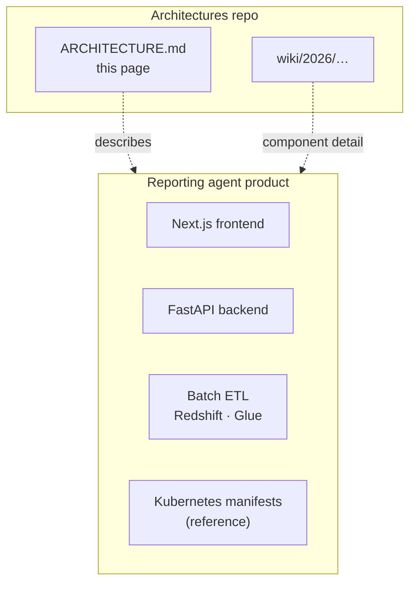
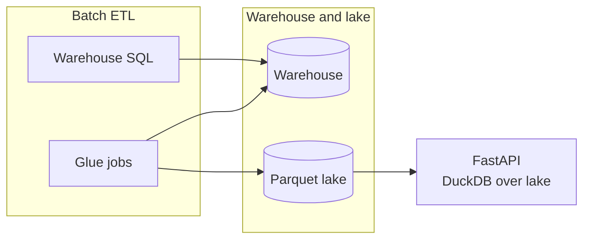
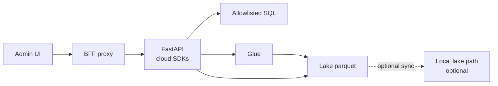
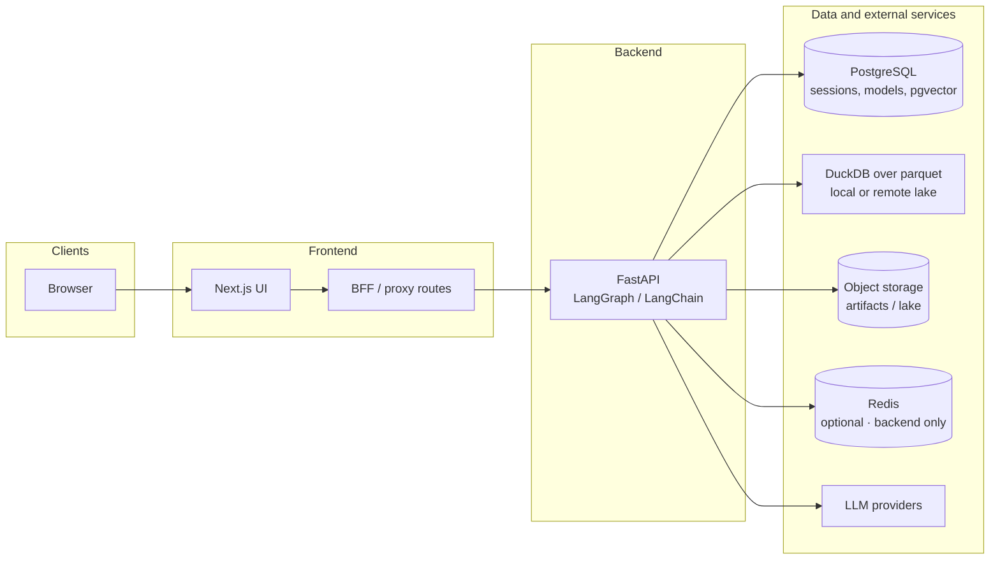
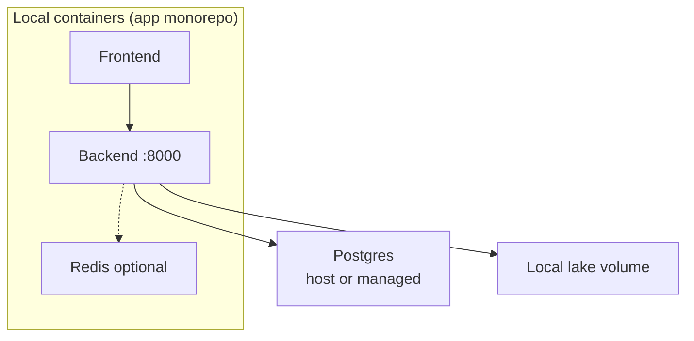
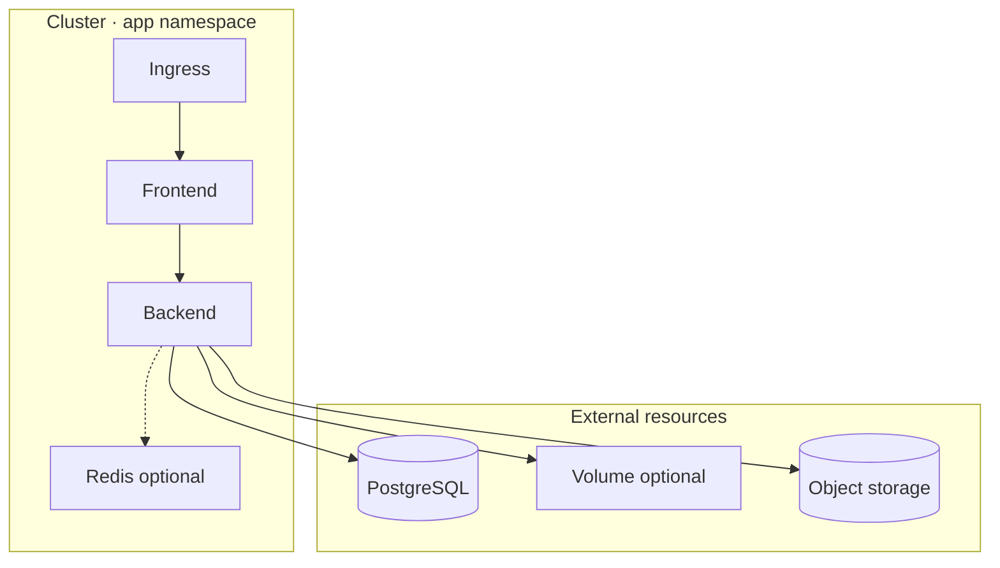
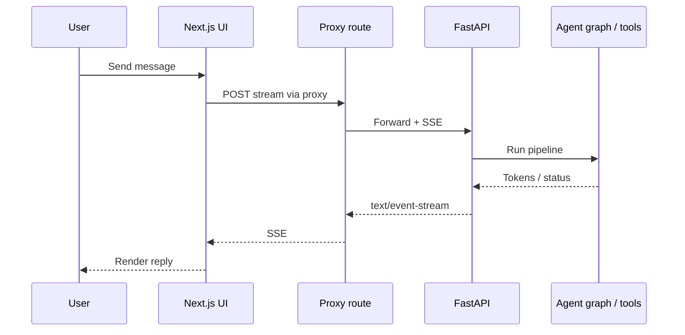

# Architecture — Reporting AI Agent (2026)

> Publish to GitHub Wiki as **2026-Reporting-AI-Agent-Architecture** (flat page name).  
> **Public-safe** — topology and patterns only. Security: [README § Security](https://github.com/osuarez1/architectures/blob/main/README.md#security).

Structural view of the reporting agent system: components, data flows, and deployment **patterns**. No runnable code in the architectures repo.

## Keeping this document current

Update when **topology** changes. Use **structural** sibling pages only ([[2026-Reporting-AI-Agent-Chat-Processing]], [[2026-Reporting-AI-Agent-Backend]], [[2026-Reporting-AI-Agent-Frontend]]). Do not add env tables, file paths, or shell commands—those belong in the private application monorepo.

Related: [[Home]] · [Repository README](https://github.com/osuarez1/architectures/blob/main/README.md) · [Publish guide (git)](https://github.com/osuarez1/architectures/blob/main/wiki/README.md)

---

## 1. System context

Logical components of the full stack (implemented in the private application monorepo):

### 1.1 Batch data pipeline (lake source)

ETL maintains warehouse tables and **unloads parquet** to object storage. The API does **not** run Glue; it reads the lake via DuckDB at query time.

**Admin ETL (privileged role):** Admin API can manage schedules/job runs, upload allowlisted SQL/scripts, optional lake sync to local volume, and read-only permission probes. Admin UI uses the frontend BFF proxy.

---

## 2. Runtime components (logical)

**Rules of thumb**

- Browser uses the **BFF**, not the API origin, for privileged flows.
- **Redis** is backend-only (cache, rate limits, locks).

---

## 3. Local development (logical pattern)

Typical local layout uses containerized frontend/backend and optional Redis; Postgres often runs on the host or a shared dev instance. Parquet may be bind-mounted for offline lake mode.

Compose files and env examples live in the **application monorepo**, not the architectures repo.

---

## 4. Production (logical pattern)

Kubernetes (or similar): frontend and backend deployments, optional Redis, ingress, managed Postgres, volume for local lake copy if used, object storage for lake and artifacts.

Deploy scripts and manifests: **application monorepo**.

---

## 5. Chat streaming (sequence)

---

## 6. Detail index

| Concern | Where to read |
|--------|----------------|
| Repo purpose & security | [Repository README](https://github.com/osuarez1/architectures/blob/main/README.md) |
| Wiki publish workflow | [wiki/README.md (git)](https://github.com/osuarez1/architectures/blob/main/wiki/README.md) |
| Project overview (2026) | [[2026-Reporting-AI-Agent]] |
| Chat question → response | [[2026-Reporting-AI-Agent-Chat-Processing]] |
| Backend / frontend (2026) | [[2026-Reporting-AI-Agent-Backend]], [[2026-Reporting-AI-Agent-Frontend]] |
| Runnable code, Compose, K8s, ETL | Application monorepo (private) |
