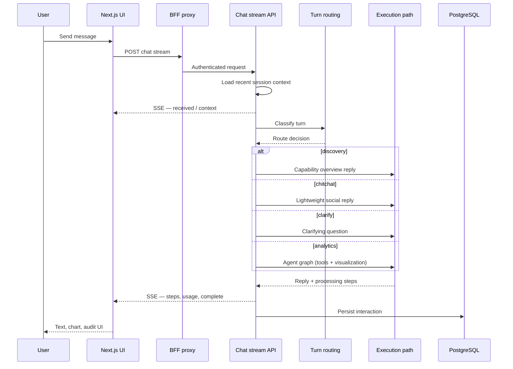
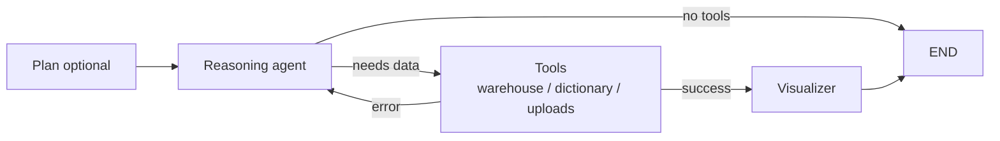

# Chat processing: question → response

> Publish to GitHub Wiki as **2026-Reporting-AI-Agent-Chat-Processing** (flat page name).  
> **Public-safe** — logical flow only. Security: [README § Security](https://github.com/osuarez1/architectures/blob/main/README.md#security). Implementation lives in the private application monorepo.

How a user message becomes an assistant reply: routing, execution paths, streaming, and persistence at a **structural** level.

Related diagrams: [[2026-Reporting-AI-Agent-Architecture]] (runtime and deploy patterns).

---

## End-to-end flow

**Rules of thumb**

- The browser uses the **BFF proxy**, not the API origin directly.
- Routing runs **before** the heavy agent path to avoid unnecessary LLM/graph work on social or meta questions.

---

## Pre-routing (every turn)

| Stage | Purpose |
|-------|---------|
| Auth & limits | Validate session; apply rate limits |
| History | Load recent turns from PostgreSQL (bounded window) |
| Uploads | Normalize attachments when present |
| Immediate SSE | Acknowledge receipt; emit “loading context” |
| Context build | Token-budgeted conversation history + session flags |
| Route | Choose execution path (see below) |

---

## Turn routing (conceptual)

Routing is **ordered**: first match wins. Optional second tier (LLM classifier) applies only when the fast rules are ambiguous.

| Priority | Signal (conceptual) | Path | `turn_route` |
|----------|---------------------|------|--------------|
| 1 | “What can I ask?” / catalog-style | Discovery | `discovery` |
| 2 | Social / short acknowledgment | Chitchat | `chitchat` |
| 3 | Data, SQL, charts, session follow-ups | Analytics | `analytics` |
| 4 | Ambiguous + classifier enabled | Classifier → chitchat, clarify, or analytics | varies |
| 5 | Ambiguous + classifier off | Default to analytics | `ambiguous` → analytics |

**Session awareness:** Short follow-ups after a prior chart/SQL turn (e.g. “why?”) stay on **analytics**, not chitchat.

**Discovery vs analytics:** Catalog questions avoid the full SQL agent; questions that imply metrics or charts route to analytics.

---

## Execution paths

### 1. Discovery

Single LLM call, no tools, no warehouse query. Answers what the assistant can help with. Skips embedding storage for the turn.

### 2. Lightweight chitchat

Single LLM call for social or brief replies. Skips embeddings. May nudge users toward data questions when appropriate.

### 3. Early clarify

Fixed or classifier-generated clarifying question; **no** agent graph.

### 4. Full analytics (LangGraph)

Default for data questions. Planner (optional) → reasoning agent with tools → visualization.

| Node | Role |
|------|------|
| **Plan** | Optional turn plan (feature-flagged) |
| **Agent** | LLM with tools; SQL over parquet lake |
| **Tools** | Query lake, lookups, uploads |
| **Visualizer** | Chart/KPI component for the UI |

**Post-graph (conceptual):** Optional large exports to object storage; chart type chosen from result shape and user intent; presigned links for embeddable HTML when needed.

---

## Processing steps (user-visible)

The stream emits **phases** the UI can show in an activity panel and audit modal:

| Phase | Typical meaning |
|-------|-----------------|
| `receive` | Question accepted |
| `context` | History and session flags ready |
| `route` | Routing (and optional classifier) done |
| `classify` | Fast path (chitchat / discovery / clarify) |
| `plan` | Analytics plan (if enabled) |
| `sql` | Reasoning / query phase (analytics) |
| `reason` | Sub-steps under SQL (memory, model call, validation) |
| `tool` | Tool execution |
| `viz` | Formatting chart or table for UI |
| `artifact` | Downloads / embed URLs |

Nested **reason** substeps group under **sql** in the audit UI during analytics turns.

---

## Streaming contract (client)

Server-sent events carry structured progress and a final payload:

| Event | Purpose |
|-------|---------|
| `status` | Short human-readable status |
| `step` | Structured processing step (id, phase, label, timing) |
| `usage_progress` | Token / embedding totals |
| `complete` | Final text, chart payload, steps, routing metadata |
| `interaction_saved` | Persisted turn id |
| `error` | Terminal failure |

The Next.js client parses SSE and drives the chat UI plus optional **processing audit** for agent turns.

---

## Persistence (conceptual)

Each turn is stored in PostgreSQL:

| Stored | Notes |
|--------|--------|
| User question | Plain text |
| Assistant payload | JSON: reply, optional chart, processing steps, route metadata |
| SQL | When analytics ran a query |
| Embeddings | For analytics turns; skipped for chitchat/discovery |
| Usage | Token counts for billing/limits |

History APIs return enough metadata to reload charts (refreshing object-storage links when needed) and show past routing/steps.

---

## Semantic memory (high level)

Optional **lessons** and past successes can be retrieved by embedding similarity and injected into the analytics agent context. Curated and auto-suggested lessons are **inactive until approved** in admin flows. Details and retention policies are configured in the application monorepo—not duplicated here.

---

## Session lifecycle (high level)

| Concern | Behavior |
|---------|---------|
| User delete session | Owner can remove a session and related artifacts |
| Retention | Scheduled cleanup of old inactive sessions unless marked exempt |
| Admin | Privileged roles can run bulk reset or memory invalidation in the app deployment |

---

## Routing examples

| User message | Path | Why |
|--------------|------|-----|
| `Hi` | Chitchat | Social |
| `What can I ask about campaigns?` | Discovery | Catalog intent |
| `Show revenue by month` | Analytics | Data / chart intent |
| `Why?` (after a chart) | Analytics | Session follow-up |
| `Why?` (no prior data turn) | Analytics (default) | Not treated as pure chitchat |

---

## Where to read more

| Topic | Location |
|-------|----------|
| System topology | [[2026-Reporting-AI-Agent-Architecture]] |
| Backend role & config | [[2026-Reporting-AI-Agent-Backend]] |
| Frontend / BFF | [[2026-Reporting-AI-Agent-Frontend]] |
| Full routing rules, code, tests, admin APIs | Private **application monorepo** |
