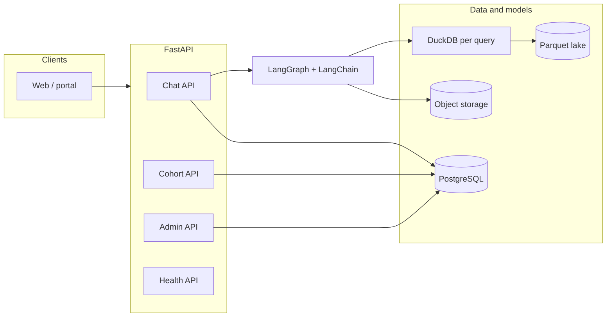

# Reporting AI Agent — Backend (2026)

> Publish to GitHub Wiki as **2026-Reporting-AI-Agent-Backend** (flat page name).  
> **Public-safe overview** — structure and responsibilities only. Security: [README § Security](https://github.com/osuarez1/architectures/blob/main/README.md#security). Configuration and code paths live in the private application monorepo.

Diagrams: [[2026-Reporting-AI-Agent-Architecture]] · Chat flow: [[2026-Reporting-AI-Agent-Chat-Processing]]

FastAPI service: **LangGraph** agent, **DuckDB** over parquet (lake), **PostgreSQL** (sessions, models, vector memory), optional **Redis**, object storage for artifacts.

## Component diagram

## Responsibilities

| Concern | Behavior |
|---------|----------|
| Chat | Streaming natural language → SQL over lake; sessions and feedback |
| Cohort | LLM-assisted cohort analysis |
| Admin | Model/role configuration; optional batch/lake controls (privileged role) |
| Health | Liveness and readiness for orchestration |
| Data | Shared application database for identity; lake read via DuckDB; batch jobs run outside this service |

## API surface (logical)

| Area | Role |
|------|------|
| Health | Process and dependency checks |
| Chat | Stream, sessions, history |
| Cohort | Analytic cohort requests |
| Admin | Configuration and privileged operations |

Exact paths and admin capabilities are defined in the **application monorepo**.

## External dependencies (conceptual)

| Dependency | Use |
|------------|-----|
| PostgreSQL | Sessions, model config, agent metadata |
| LLM provider | Reasoning, classification, embeddings |
| Object storage | Lake parquet, large exports, chart artifacts |
| Redis (optional) | Cache, rate limits, distributed locks |
| Cloud data services (optional) | Admin batch/lake integration when enabled |

## Configuration

Environment variables (connection strings, API keys, lake location, feature flags) are documented and set in the **application monorepo** only—not duplicated in this public wiki.

## Where to read more

| Topic | Location |
|-------|----------|
| System topology | [[2026-Reporting-AI-Agent-Architecture]] |
| Chat routing and streaming | [[2026-Reporting-AI-Agent-Chat-Processing]] |
| Frontend / BFF | [[2026-Reporting-AI-Agent-Frontend]] |
| Runbooks, Docker, migrations, tests | Private **application monorepo** |
